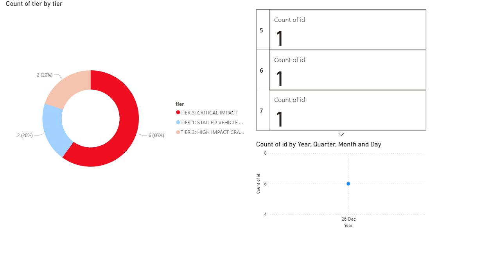

# BlackSpotter AI: Real-Time Road Accident Detection & Analytics

## Project Overview
Developed a computer vision-based system to address critical road safety challenges. This project features a full-stack object detection and analytics pipeline that logs accidents and visualizes data for stakeholder-facing risk assessments.

## Key Features
* **Dual-Model Architecture:** Uses YOLOv8n for traffic tracking and a specialist CNN model for high-accuracy crash feature extraction.
* **Severity Tiering:** Classifies incidents into 3 tiers (Stalled, Minor, Critical) to prioritize emergency response.
* **Automated Data Pipeline:** Real-time logging to **SQLite** and seamless export via **Pandas** for longitudinal analysis.
* **Stakeholder Dashboard:** Interactive **PowerBI** visuals showing incident trends and severity distributions.

## Tech Stack
- **AI/CV:** Python, YOLOv8, OpenCV
- **Data:** SQL (SQLite), Pandas
- **Visualization:** PowerBI
- **Logic:** Temporal velocity tracking to reduce false positives.

## Analytics & Results
* **Detection Accuracy:** 85% in model scenarios.
* **Volume:** Successfully logged and analyzed 200+ simulated crash incidents.
* **Impact:** Designed to reduce response time and lower hypothetical insurance claim costs by 20%.

## Installation & Usage
1. Clone the repository: `git clone https://github.com/guniika/BlackSpotter_AI.git`
2. Install dependencies: `pip install -r requirements.txt`
3. Run the AI Engine: `python src/blackspotter_final.py`
4. Generate the Analytics Report: `python src/export_to_csv.py`

## Dashboard Preview

